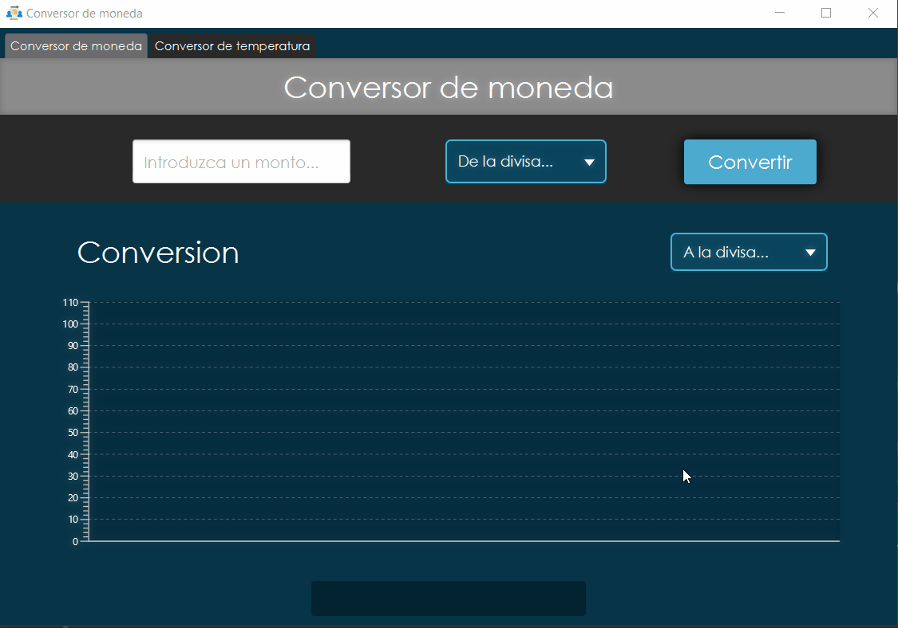

<div align="center"></div>

# 💱 Conversor de moneda

<div align="center"></div>

<div align="center">
    
    
    
</div>

------

## 💡 Descripción
Conversor de moneda desarrollado con Java para el challenge del ***Proyecto ONE*** de **Oracle+Alura LATAM**.

El desafio consiste en crear un conversor de divisas utilizando el lenguaje Java. Ademas se alienta a añadir otro tipo de conversor ya sea de temperatura, o otras magnitudes fisicas.

El desarollo fue llevado a cabo sobre la plataforma de aplicaciones cliente JavaFx con ayuda de la herramienta de gestion y construccion de proyectos Maven.
La interfaz grafica basicamente consiste de panel con 2 tabs para optar por algun tipo de conversion, donde cada conversion consta de 2 combo box para seleccionar la unidad de entrada y la unidad de salida, un campo texto para introducir el valor que queremos convertir, un campo de texto para presentar la conversion y un grafico que enseña una linea de tiempo del cambio de la tasa entre dos monedas para el conversor de moneda y un grafico que muestra la curva de conversion para las temperaturas.

------

## 	✔️ Requisitos

- El convertidor de moneda debe:
```
Convertir de la moneda de tu país a Dólar
Convertir de la moneda de tu país a Euros
Convertir de la moneda de tu país a Libras Esterlinas
Convertir de la moneda de tu país a Yen Japonés
Convertir de la moneda de tu país a Won sul-coreano
```

- Recordando que también debe ser posible convertir inversamente, es decir:
```
Convertir de Dólar a la moneda de tu país
Convertir de Euros a la moneda de tu país
Convertir de Libras Esterlinas a la moneda de tu país
Convertir de Yen Japonés a la moneda de tu país
Convertir de Won sul-coreano a la moneda de tu país
```

### Extras:
- Como desafío extra nos animan a que dejemos fluir nuestra creatividad, si puedo convertir divisas, ¿tal vez pueda añadir a mi programa otros tipos de conversiones como temperatura por ejemplo?

- Es hora de sorprender a nuestro cliente con una función que tal vez ni siquiera sabía que necesitaba.

### 👁️ Vista previa:

